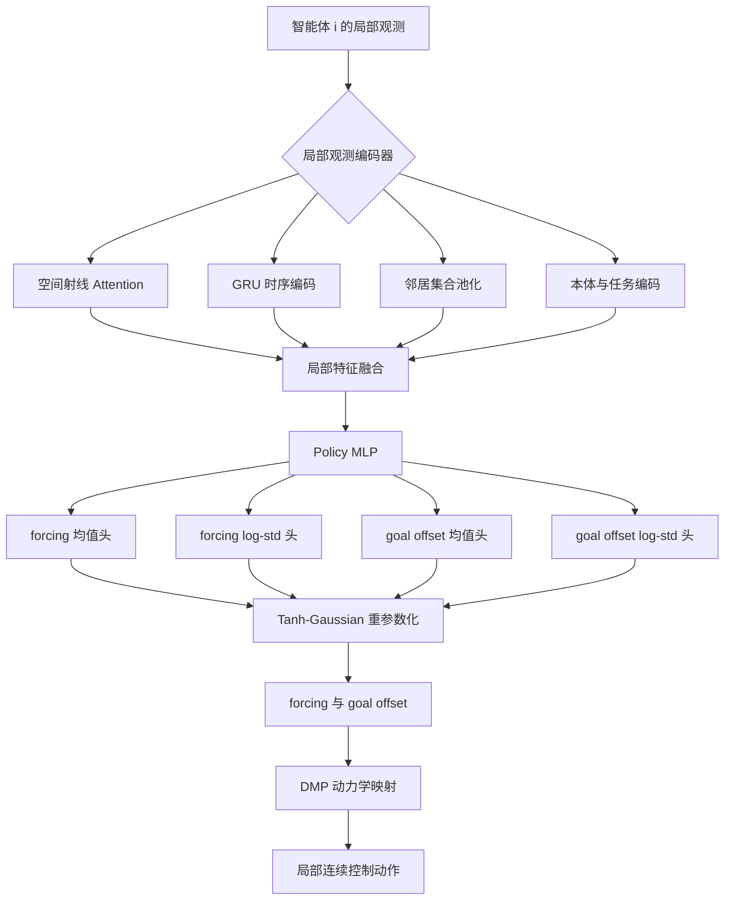
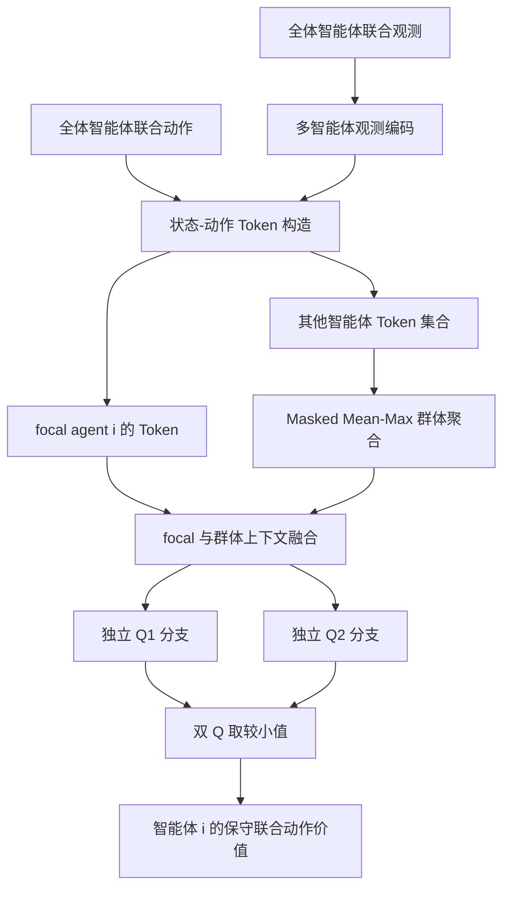

# MASAC Actor 与 Critic 差异化网络设计

本文档从理论层面说明 MASAC 中 Actor 与 Critic 的非对称网络结构，重点分析二者在信息范围、特征组织、输出分支和训练目标上的差异。

## 1. Actor–Critic 非对称网络设计

MASAC 中的 Actor 与 Critic 并不是仅在输出层上有所区别，而是针对两个不同问题构造的非对称网络：

- Actor 解决“单个智能体在局部信息约束下应如何行动”的策略生成问题；
- Critic 解决“给定群体联合行为，当前 focal agent 能获得多大长期价值”的价值评估问题。

因此，Actor 强调局部感知压缩、动作分布建模与动力学参数生成；Critic 强调联合状态—动作关系、跨智能体交互聚合与保守价值估计。二者在输入信息、特征组织、输出形式及优化目标上均具有本质差异。

其总体映射分别为：

\[
\underbrace{o_i}_{\text{局部观测}}
\xrightarrow{\text{Actor}}
\underbrace{(\mu_i,\log\sigma_i)}_{\text{动作分布参数}}
\xrightarrow{\text{sample}}
\underbrace{a_i}_{\text{局部策略动作}},
\]

\[
\underbrace{\{(o_j,a_j)\}_{j=1}^{N}}_{\text{联合观测--动作}}
\xrightarrow{\text{Critic}_i}
\underbrace{(Q_{i,1},Q_{i,2})}_{\text{focal agent 双价值估计}}.
\]

这种非对称结构是 CTDE 成立的网络基础：Actor 在执行阶段保持局部信息闭环，Critic 在训练阶段利用全体智能体信息提供更完整的策略梯度。

## 2. Actor 网络结构

Actor 是面向分散执行的局部随机策略网络。对智能体 \(i\)，其网络由“局部观测编码—策略特征提取—动作分支参数化—有界随机采样—动力学映射”五个层级构成。

### 2.1 局部观测编码层

Actor 仅接收自身局部观测 \(o_i\)，并分别处理：

- 本体运动状态与目标信息；
- 空间射线传感器序列；
- 短期时序上下文；
- 可观测的邻近智能体集合。

编码结果形成局部决策表示：

\[
z_i^{actor}
=f_{obs}^{actor}(o_i)
=[z_i^{sensor},z_i^{temporal},z_i^{ally},z_i^{task}].
\]

该表示只包含执行阶段可获得的信息，从网络结构上保证分散部署条件。

### 2.2 策略特征层

局部决策表示经过 Policy MLP，形成动作生成隐变量：

\[
h_i^{\pi}=f_{policy}(z_i^{actor}).
\]

该层用于将异构观测特征转换为统一的控制决策表示，不直接输出确定性动作。

### 2.3 差异化动作分支

在 DMP 参数化策略中，动作由 forcing term 与 goal offset 两类变量组成：

\[
a_i^{policy}=[f_i,\Delta g_i].
\]

由于两类动作承担不同控制作用，Actor 分别建立动作头：

\[
\begin{aligned}
\mu_i^f&=f_{\mu_f}(h_i^{\pi}),
&\log\sigma_i^f&=f_{\sigma_f}(h_i^{\pi}),\\
\mu_i^g&=f_{\mu_g}(h_i^{\pi}),
&\log\sigma_i^g&=f_{\sigma_g}(h_i^{\pi}).
\end{aligned}
\]

最终将两类分布参数拼接：

\[
\mu_i=[\mu_i^f,\mu_i^g],
\qquad
\log\sigma_i=[\log\sigma_i^f,\log\sigma_i^g].
\]

forcing 分支用于学习对基础 DMP 轨迹形状的非线性修正，goal offset 分支用于调整局部吸引目标。分支独立输出均值和方差，使两类控制变量可以形成不同的探索尺度。

### 2.4 随机动作与动力学层

Actor 使用重参数化 Gaussian 生成动作：

\[
u_i=\mu_i+\sigma_i\odot\epsilon,
\qquad \epsilon\sim\mathcal N(0,I),
\]

再通过 `tanh` 形成有界策略动作。随后，forcing term 与 goal offset 进入 DMP 动力学映射，得到实际控制作用：

\[
a_i^{ctrl}=g_{DMP}(o_i,f_i,\Delta g_i).
\]

因此，Actor 的输出终点不是单一线性动作层，而是“概率分布参数—随机采样—动作约束—DMP 动力学”的连续生成链路。

## 3. Critic 网络结构

Critic 是面向集中训练的联合价值网络。对于 focal agent \(i\)，其网络由“多智能体观测编码—状态动作 token 构造—focal/other 分离—群体上下文聚合—双 Q 价值分支”五个层级构成。

### 3.1 联合信息输入层

Critic 接收所有智能体的观测与动作：

\[
\mathbf o=(o_1,\ldots,o_N),
\qquad
\mathbf a=(a_1,\ldots,a_N).
\]

这里的动作应表示能够真实影响环境转移的控制作用。若 Actor 输出经过 DMP 映射，则 Critic 应评价映射后的联合控制效果，而不是仅评价抽象的策略参数。

### 3.2 状态—动作 token 层

每个智能体的观测首先被编码为特征 \(z_j^Q\)，再与动作融合：

\[
z_j^Q=f_{obs}^{Q}(o_j),
\qquad
t_j=f_{sa}([z_j^Q,a_j]).
\]

与 Actor 的策略特征不同，Critic token 必须同时包含“智能体处于何种状态”和“智能体采取何种动作”，从而表示局部状态—动作贡献。

### 3.3 Focal-agent 与群体上下文分离

对需要评估的智能体 \(i\)，其 token \(t_i\) 被单独保留。其余智能体构成集合：

\[
\mathcal T_{-i}=\{t_j\mid j\neq i\}.
\]

群体上下文通过置换不变聚合获得：

\[
c_{-i}=\operatorname{Pool}(\mathcal T_{-i}).
\]

随后形成 focal-agent 条件价值特征：

\[
h_i^Q=f_{joint}([t_i,c_{-i}]).
\]

该结构不对所有智能体进行无差别压缩，而是明确区分“被评价智能体自身行为”和“其他智能体形成的交互背景”。

### 3.4 双 Q 价值分支

Critic 使用两个参数独立的价值分支：

\[
Q_{i,1}=f_{Q_1}(\mathbf o,\mathbf a),
\qquad
Q_{i,2}=f_{Q_2}(\mathbf o,\mathbf a).
\]

两个分支具有相同输入语义，但独立学习价值近似，并使用较小值：

\[
Q_i^{min}=\min(Q_{i,1},Q_{i,2}).
\]

与 Actor 的多分支输出不同，Critic 的 Q1/Q2 并不对应不同动作物理语义，而是对同一联合状态—动作价值进行两次独立估计，用于抑制过估计偏差。

## 4. Actor 与 Critic 的逐层结构差异

| 设计层级 | Actor 网络 | Critic 网络 | 差异形成的原因 |
|---|---|---|---|
| 任务目标 | 生成局部连续动作 | 评价 focal agent 的长期价值 | 策略生成与价值评估属于不同学习问题 |
| 输入范围 | 单个智能体局部观测 \(o_i\) | 联合观测与联合动作 \((\mathbf o,\mathbf a)\) | Actor 满足分散执行，Critic 利用集中训练信息 |
| 观测编码 | 强调自身空间感知、时序变化与局部邻居 | 对所有智能体分别形成可评价表征 | Critic 需要解释群体行为对回报的影响 |
| 动作输入 | 不输入已有动作 | 显式输入所有智能体动作 | Critic 估计状态—动作价值函数 |
| 核心隐变量 | 局部策略特征 \(h_i^{\pi}\) | 联合价值特征 \(h_i^Q\) | 前者服务动作分布，后者服务回报预测 |
| 跨智能体结构 | 仅编码局部可见邻居 | 聚合全体其他智能体 token | Critic 需要缓解多智能体非平稳性 |
| 身份处理 | 以当前智能体局部视角决策 | 显式区分 focal agent 与 other agents | 每个 Critic 对应不同价值主体 |
| 输出结构 | forcing/goal offset 的 \(\mu\) 与 \(\log\sigma\) | 相互独立的 \(Q_1\) 与 \(Q_2\) | Actor 表达动作随机性，Critic 抑制价值过估计 |
| 输出维度 | 与连续动作维数相关 | 每个 Q 分支输出一个标量 | 策略输出控制变量，价值网络输出长期回报 |
| 随机性 | Tanh-Gaussian 随机策略 | 确定性价值估计 | 随机性用于探索，而价值目标需要稳定估计 |
| 动力学关系 | 输出进入 DMP 动力学映射 | 评价 DMP 映射后的联合控制效果 | 策略参数必须通过实际控制结果接受价值反馈 |
| 优化目标 | 最大化 Q 值与策略熵 | 最小化 Soft Bellman residual | 策略改进与策略评价相互配合 |
| 使用阶段 | 训练与分散执行 | 仅用于集中训练 | 部署阶段不应依赖全局联合信息 |

由此可以将二者概括为：

> Actor 是“局部感知驱动的概率控制生成网络”，Critic 是“focal-agent 条件下的联合状态—动作价值网络”。

## 5. 不同智能体之间的差异化方式

需要区分“Actor 与 Critic 之间的结构差异”和“不同智能体网络之间的结构差异”。在同构多智能体任务中，不同智能体通常采用：

\[
\text{同构网络拓扑}
+\text{独立可学习参数}
+\text{不同局部数据分布}
+\text{不同 focal-agent 价值条件}.
\]

具体而言：

- 各 Actor 使用相同的网络拓扑，但可分别学习策略参数 \(\theta_i\)；
- 各 Critic 使用相同的双 Q 拓扑，但分别以智能体 \(i\) 作为 focal agent；
- 不同 Actor 因局部观测、运动状态与任务经历不同，可形成不同决策偏好；
- 不同 Critic 因个体奖励和 focal 身份不同，学习不同的价值函数 \(Q_i\)。

因此，该设计应表述为“同构拓扑、独立参数、focal-agent 条件差异化”，而不应直接称为异构 Actor 或异构 Critic。只有当不同智能体具有不同传感器、动作空间、动力学模型或任务角色时，才需要进一步设计真正异构的网络结构。

## 6. 组会汇报总结

MASAC 的 Actor 与 Critic 分别服务于策略生成和价值评估，因此采用结构非对称设计。Actor 以单个智能体的局部观测为输入，通过空间—时间—邻居特征编码形成局部策略表示，并利用 forcing term 与 goal offset 两组概率动作头生成 DMP 策略参数。Critic 以全体智能体的联合观测和联合动作为输入，通过状态—动作 token、focal/other 分离和群体上下文聚合建立集中式价值表示，再由两个独立 Q 分支形成保守价值估计。

从 CTDE 角度看，Actor 的局部输入约束保证策略能够分散执行，Critic 的联合信息输入则用于缓解训练阶段的多智能体非平稳性。不同智能体之间采用同构拓扑、独立参数和 focal-agent 条件差异化；Actor 与 Critic 之间则在输入、隐变量、输出和目标函数层面形成明确的非对称结构。

