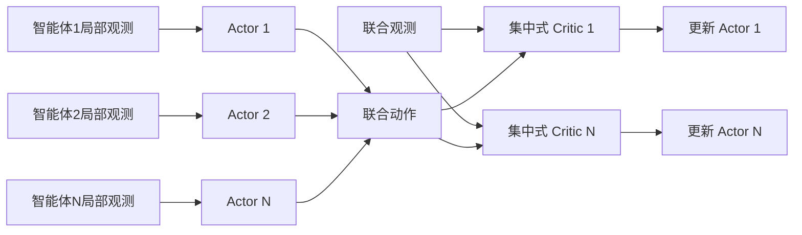
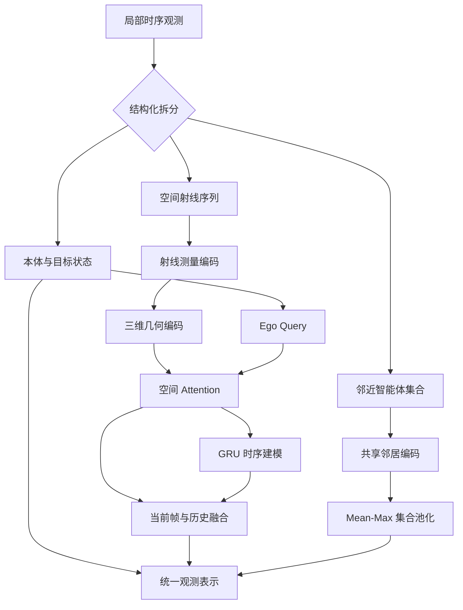
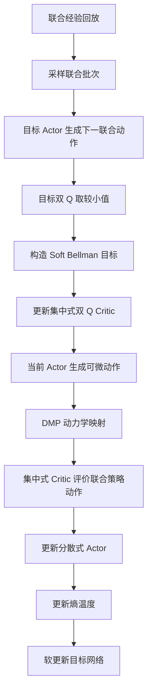

# MASAC 理论与策略网络设计

## 1. 问题背景

多智能体连续控制任务要求多个智能体在共享环境中完成协同决策。以多 UAV 三维避障为例，每个智能体需要依据局部传感器观测生成连续控制动作，同时处理目标趋近、障碍规避、智能体间避碰以及协同运动等多重约束。

与单智能体强化学习相比，多智能体任务主要面临以下理论问题：

1. **环境非平稳性**：对任一智能体而言，其他智能体的策略会随训练持续变化，因此环境状态转移不再满足固定的马尔可夫过程。
2. **联合动作空间扩张**：智能体数量增加后，联合动作空间维度快速增长，价值函数学习难度显著提高。
3. **局部可观测性**：单个智能体通常只能获得自身状态和局部传感器信息，无法完整观测全局状态。
4. **协同信用分配**：团队回报由多个智能体共同作用产生，难以判断单个智能体动作对最终结果的贡献。
5. **探索与安全冲突**：随机探索有利于发现高回报策略，但在避障任务中可能增加碰撞风险。

MASAC（Multi-Agent Soft Actor-Critic）在 Soft Actor-Critic 的最大熵强化学习框架上引入集中训练、分散执行机制，通过集中式价值评估缓解多智能体非平稳性，并通过随机策略与熵正则实现连续动作空间中的稳定探索。

## 2. 多智能体决策模型

多智能体任务可表示为 Dec-POMDP：

\[
\mathcal{G}=\langle
\mathcal{I},\mathcal{S},\{\mathcal{O}_i\},
\{\mathcal{A}_i\},P,\{r_i\},\gamma
\rangle,
\]

其中：

- \(\mathcal{I}=\{1,\ldots,N\}\) 为智能体集合；
- \(s_t\in\mathcal{S}\) 为全局环境状态；
- \(o_{i,t}\in\mathcal{O}_i\) 为智能体 \(i\) 的局部观测；
- \(a_{i,t}\in\mathcal{A}_i\) 为智能体 \(i\) 的连续动作；
- \(\mathbf a_t=(a_{1,t},\ldots,a_{N,t})\) 为联合动作；
- \(P(s_{t+1}|s_t,\mathbf a_t)\) 为状态转移概率；
- \(r_i(s_t,\mathbf a_t)\) 为智能体 \(i\) 的即时回报；
- \(\gamma\in[0,1)\) 为折扣因子。

每个智能体依据局部观测执行随机策略：

\[
a_{i,t}\sim\pi_i(\cdot|o_{i,t}).
\]

当各智能体策略条件独立时，联合策略可写为：

\[
\boldsymbol\pi(\mathbf a_t|\mathbf o_t)
=\prod_{i=1}^{N}\pi_i(a_{i,t}|o_{i,t}).
\]

尽管各 Actor 在执行阶段独立决策，联合动作仍通过环境动力学和团队回报产生耦合。因此，策略学习不能仅考虑单个智能体的局部动作价值，还需要刻画其他智能体动作对当前智能体回报的影响。

## 3. MASAC 总体理论框架

MASAC 采用集中训练、分散执行（Centralized Training with Decentralized Execution, CTDE）框架。

### 3.1 分散式 Actor

每个智能体具有独立策略：

\[
\pi_{	heta_i}(a_i|o_i),
\]

其输入仅包含智能体自身可获得的局部观测。因此，训练完成后无需访问全局状态或其他智能体的完整信息，即可独立生成动作。

### 3.2 集中式 Critic

训练阶段为智能体 \(i\) 构造集中式动作价值函数：

\[
Q_i(\mathbf o,\mathbf a)
=Q_i(o_1,\ldots,o_N,a_1,\ldots,a_N).
\]

Critic 利用联合观测与联合动作解释回报来源，使价值估计能够显式考虑智能体之间的交互关系。由于其他智能体动作已作为 Critic 输入，单个智能体无需将其影响视为不可解释的环境噪声，从而缓解训练过程中的非平稳性。

### 3.3 最大熵策略优化

MASAC 不仅最大化期望累计回报，同时最大化策略熵：

\[
J(\boldsymbol\pi)
=\mathbb E_{\boldsymbol\pi}
\left[
\sum_{t=0}^{\infty}\gamma^t
\left(
r_t+\sum_{i=1}^{N}\alpha_i
\mathcal H(\pi_i(\cdot|o_{i,t}))
\right)
\right].
\]

其中：

\[
\mathcal H(\pi_i(\cdot|o_i))
=-\mathbb E_{a_i\sim\pi_i}
[\log\pi_i(a_i|o_i)].
\]

熵项用于鼓励策略保持随机性，避免训练早期过快收敛到次优确定性行为。温度系数 \(\alpha_i\) 控制任务回报与策略随机性之间的权衡：

- \(\alpha_i\) 较大时，策略更重视探索；
- \(\alpha_i\) 较小时，策略更重视当前价值最大化。

### 3.4 Actor–Critic 网络结构说明

MASAC 采用非对称 Actor–Critic 网络：Actor 面向局部策略生成，Critic 面向联合价值评估。二者的完整层级结构、差异化动作分支、focal-agent 价值建模及逐层对比，参见 [MASAC Actor与Critic差异化网络设计](./MASAC_Actor与Critic差异化网络设计.md)。

## 4. 策略网络的观测表征

多 UAV 避障任务中的局部观测通常包含本体运动状态、目标相对信息、障碍传感器扫描以及邻近智能体状态。不同信息具有不同的数据结构，因此需要采用结构化表征，而不是将全部输入直接展平。

设智能体 \(i\) 的局部观测为：

\[
o_i=[o_i^{ego},o_i^{sensor},o_i^{ally},o_i^{task}].
\]

其中：

- \(o_i^{ego}\)：速度、姿态或其他本体运动状态；
- \(o_i^{sensor}\)：空间射线或距离传感器信息；
- \(o_i^{ally}\)：邻近智能体的相对位置和相对速度；
- \(o_i^{task}\)：目标方向、目标距离及任务阶段信息。

结构化编码的目的，是针对不同观测块建立符合其物理属性的特征提取机制，并在统一隐空间中完成融合。

## 5. 空间射线注意力机制

### 5.1 射线特征构造

对第 \(r\) 条传感器射线，可构造：

\[
x_{t,r}^{ray}
=[d_{t,r},d_{t-1,r},\Delta d_{t,r},h_{t,r}],
\]

其中：

\[
\Delta d_{t,r}=d_{t,r}-d_{t-1,r}.
\]

当前距离反映障碍空间分布，历史距离与差分反映障碍相对运动趋势，命中标记 \(h_{t,r}\) 用于区分有效障碍测量与传感器量程边界。

### 5.2 射线几何编码

若只输入距离数值，网络无法直接区分射线对应的空间方向。对方位角 \(\varphi_r\) 和俯仰角 \(\vartheta_r\)，可构造几何编码：

\[
p_r=
[d_x,d_y,d_z,
\sin\varphi_r,\cos\varphi_r,
\sin\vartheta_r,\cos\vartheta_r],
\]

其中：

\[
\begin{aligned}
d_x&=\cos\vartheta_r\cos\varphi_r,\\
d_y&=\cos\vartheta_r\sin\varphi_r,\\
d_z&=\sin\vartheta_r.
\end{aligned}
\]

射线 token 可表示为：

\[
e_{t,r}=f_{ray}(x_{t,r}^{ray})+W_p p_r.
\]

该编码将测量值与三维方向绑定，使网络能够学习“前方近障碍”“侧后方安全空间”等具有明确几何意义的特征。

### 5.3 Ego-conditioned Attention

本体状态与目标信息编码为查询向量：

\[
q_t=f_{ego}(o_t^{ego},o_t^{task}).
\]

全部射线 token 作为 Key 和 Value：

\[
K_t=V_t=[e_{t,1},\ldots,e_{t,R}].
\]

注意力输出为：

\[
c_t=\operatorname{softmax}
\left(\frac{q_tK_t^\top}{\sqrt{d}}
\right)V_t.
\]

该机制通过当前速度、目标方向和目标距离动态调整不同射线的重要性。例如，当智能体高速向前运动时，前方近距离射线应具有更高权重；当目标位于侧方时，目标侧障碍和可通行区域应获得更多关注。

因此，Attention 的主要作用不是简单压缩输入维数，而是建立任务状态与空间障碍之间的条件关联。

## 6. GRU 时序表征

单帧距离扫描只能描述当前几何关系，难以区分静态障碍与快速接近的动态对象。为此，可将连续帧空间上下文输入 GRU：

\[
h_t=\operatorname{GRU}(c_t,h_{t-1}).
\]

GRU 通过更新门与重置门控制历史信息保留程度：

\[
\begin{aligned}
z_t&=\sigma(W_zc_t+U_zh_{t-1}),\\
r_t&=\sigma(W_rc_t+U_rh_{t-1}),\\
\tilde h_t&=\tanh(W_hc_t+U_h(r_t\odot h_{t-1})),\\
h_t&=(1-z_t)\odot h_{t-1}+z_t\odot\tilde h_t.
\end{aligned}
\]

最终传感器表示可融合当前帧上下文与历史隐藏状态：

\[
z_t^{sensor}=f_{fusion}([c_t,h_t]).
\]

其中，当前帧上下文保留即时避障信息，GRU 隐状态描述短时间内的运动变化趋势。二者结合能够降低仅依赖历史状态造成的响应滞后，同时提高对动态环境的辨识能力。

## 7. 邻近智能体集合编码

邻近智能体数量可能随场景和感知范围变化，因此不适合使用固定顺序拼接。设智能体 \(i\) 可观测到的邻居集合为 \(\mathcal N_i\)，每个邻居特征为 \(x_{ij}\)。首先使用共享映射：

\[
e_{ij}=f_{ally}(x_{ij}),\qquad j\in\mathcal N_i.
\]

然后通过集合池化获得固定维表示：

\[
z_i^{ally}
=\left[
\frac{1}{|\mathcal N_i|}\sum_{j\in\mathcal N_i}e_{ij},
\max_{j\in\mathcal N_i}e_{ij}
\right].
\]

Mean pooling 描述邻域整体分布，Max pooling 突出最显著的局部交互，例如距离最近或碰撞风险最高的智能体。由于池化结果不依赖邻居排列，该结构适合处理可变规模的邻居集合。

局部观测的最终表示为：

\[
z_i=[z_i^{sensor},z_i^{ally},z_i^{ego},z_i^{task}].
\]

## 8. Tanh-Gaussian 随机策略

### 8.1 Gaussian 策略参数化

Actor 根据观测表示输出动作分布的均值和对数标准差：

\[
\mu_i=f_\mu(z_i),\qquad
\log\sigma_i=f_\sigma(z_i).
\]

策略的基础分布为对角 Gaussian：

\[
u_i\sim
\mathcal N(\mu_i,\operatorname{diag}(\sigma_i^2)).
\]

相较确定性策略，随机策略能够在相同观测下产生不同动作，为复杂障碍场景提供多样化轨迹探索能力。

### 8.2 重参数化技巧

直接从概率分布采样会阻断梯度传播。SAC 使用重参数化：

\[
\epsilon_i\sim\mathcal N(0,I),
\qquad
u_i=\mu_i+\sigma_i\odot\epsilon_i.
\]

随机性被转移到与网络参数无关的噪声 \(\epsilon_i\)，使动作成为 \(\mu_i\) 与 \(\sigma_i\) 的可微函数，从而允许梯度由 Critic 经动作传递至 Actor。

### 8.3 动作有界化

Gaussian 样本定义在无界空间，而实际控制动作具有上下界。通过 `tanh` 变换得到：

\[
\tilde a_i=\tanh(u_i).
\]

若动作上下界分别为 \(a_{low}\) 和 \(a_{high}\)，则：

\[
a_i=
\frac{a_{high}-a_{low}}{2}\odot\tilde a_i
+\frac{a_{high}+a_{low}}{2}.
\]

该变换在保证动作有界的同时保持可微性。

### 8.4 概率密度修正

由于 `tanh` 与线性缩放改变了概率密度，动作 log-probability 需要进行变量变换修正：

\[
\log\pi_i(a_i|o_i)
=\log\mathcal N(u_i;\mu_i,\sigma_i)
-\sum_k\log(1-\tanh^2(u_{i,k}))
-\sum_k\log s_{a,k},
\]

其中 \(s_a=(a_{high}-a_{low})/2\)。该修正保证熵估计与实际有界动作分布一致，是最大熵策略优化成立的必要条件。

## 9. DMP 参数化策略

### 9.1 设计动机

若 Actor 直接输出加速度，策略需要同时学习目标吸引、速度阻尼、轨迹平滑与障碍修正等全部控制规律，搜索空间较大。DMP（Dynamic Movement Primitives）通过显式动力学结构引入运动先验，使 Actor 重点学习对基础运动模式的修正。

策略动作可划分为：

\[
a_i^{policy}=[f_i,\Delta g_i],
\]

其中：

- \(f_i\) 为 forcing term，用于修正标准 DMP 轨迹；
- \(\Delta g_i\) 为局部目标偏移，用于改变短期运动引导方向。

### 9.2 DMP 动力学映射

设当前速度为 \(v_i\)，目标相对位移为 \(\Delta x_{g,i}\)，则有效目标位移为：

\[
\Delta x_{g,i}^{eff}
=\Delta x_{g,i}+\Delta g_i.
\]

控制加速度可表示为：

\[
\ddot x_i=
\frac{
K_\alpha(K_\beta\Delta x_{g,i}^{eff}-\tau v_i)
+f_i\odot\eta_i
}{\tau^2},
\]

其中 \(K_\alpha\) 控制目标吸引强度，\(K_\beta\) 控制阻尼特性，\(\tau\) 控制运动时间尺度，\(\eta_i\) 为 forcing term 的门控函数。

在没有 forcing term 时，该系统表现为向目标收敛的二阶吸引系统；forcing term 用于表达障碍绕行或复杂轨迹形状；goal offset 用于在局部范围内调整吸引中心。

### 9.3 理论作用

DMP 参数化在 MASAC 中具有三方面作用：

1. **降低策略搜索难度**：目标趋近和速度阻尼由动力学先验提供，Actor 重点学习残差修正。
2. **提高轨迹连续性**：动作经过二阶动力学结构生成，能够抑制不连续控制变化。
3. **连接规划与控制**：goal offset 描述局部引导，forcing term 描述轨迹形状修正，从而形成目标层与控制层之间的连续接口。

因此，DMP 并非 Actor 之后的独立控制器，而是策略参数化的一部分。Critic 对 DMP 映射后的实际控制效果进行评估，策略梯度再通过可微动力学映射传回 Actor。

## 10. 集中式双 Q Critic

### 10.1 联合状态—动作价值

对智能体 \(i\)，集中式 Critic 估计：

\[
Q_i(\mathbf o,\mathbf a)
=\mathbb E
\left[
\sum_{t=0}^{\infty}\gamma^t
\left(r_{i,t}+\alpha_i\mathcal H_{i,t}\right)
\middle|
\mathbf o_0=\mathbf o,
\mathbf a_0=\mathbf a
\right].
\]

该价值函数能够描述以下关系：

- 当前智能体动作与任务进度之间的关系；
- 不同智能体动作之间的协同或冲突；
- 局部避障行为对团队安全性的影响；
- 联合动作对未来状态分布的长期影响。

### 10.2 Focal-agent 集合建模

首先对每个智能体的观测与动作形成局部 token：

\[
t_j=f_{sa}([z_j,a_j]).
\]

对于 focal agent \(i\)，保留自身 token，并聚合其他智能体信息：

\[
c_{-i}=\operatorname{Pool}(\{t_j:j\neq i\}).
\]

最终价值估计为：

\[
Q_i=f_Q([t_i,c_{-i}]).
\]

该结构将自身决策变量与群体上下文显式分离，并通过置换不变的集合聚合适配智能体排列变化。其本质是学习“当前智能体在给定群体行为背景下的动作价值”。

### 10.3 双 Q 机制

为降低函数逼近误差造成的价值过估计，每个智能体维护两个独立 Critic：

\[
Q_{i,1}(\mathbf o,\mathbf a),
\qquad
Q_{i,2}(\mathbf o,\mathbf a).
\]

在构造目标值和更新 Actor 时采用：

\[
Q_i^{min}=\min(Q_{i,1},Q_{i,2}).
\]

取较小值会引入一定保守性，但能够降低策略利用单个 Critic 高估区域的风险，从而提高连续控制训练的稳定性。

## 11. Soft Bellman 方程

对智能体 \(i\)，下一时刻联合动作为：

\[
a_j'\sim\pi_j(\cdot|o_j'),
\qquad j=1,\ldots,N.
\]

Soft state value 为：

\[
V_i(\mathbf o')=
\mathbb E_{\mathbf a'\sim\boldsymbol\pi}
\left[
Q_i^{min}(\mathbf o',\mathbf a')
-\alpha_i\log\pi_i(a_i'|o_i')
\right].
\]

对应 Soft Bellman 方程为：

\[
Q_i(\mathbf o,\mathbf a)
=r_i+\gamma(1-d_i)V_i(\mathbf o').
\]

采样形式的目标值为：

\[
y_i=r_i+\gamma(1-d_i)
\left[
\min_{k\in\{1,2\}}
Q_{\bar\phi_{i,k}}(\mathbf o',\mathbf a')
-\alpha_i\log\pi_i(a_i'|o_i')
\right].
\]

其中 \(d_i\) 表示终止状态，\(\bar\phi\) 表示目标 Critic 参数。

Critic 损失为：

\[
\mathcal L_{Q_i}
=\sum_{k=1}^{2}
\mathbb E_{\mathcal D}
\left[
\left(Q_{\phi_{i,k}}(\mathbf o,\mathbf a)-y_i\right)^2
\right].
\]

## 12. Actor 优化目标

固定 Critic 后，智能体 \(i\) 的 Actor 目标为：

\[
\mathcal L_{\pi_i}
=\mathbb E_{\mathbf o\sim\mathcal D,
a_i\sim\pi_i}
\left[
\alpha_i\log\pi_i(a_i|o_i)
-Q_i^{min}(\mathbf o,\mathbf a^{\pi})
\right].
\]

该目标包含两个方向相反的因素：

- 最小化 \(-Q_i^{min}\)，推动 Actor 选择高价值动作；
- 最小化 \(\alpha_i\log\pi_i\)，推动 Actor 保持足够策略熵。

在多智能体场景中，更新智能体 \(i\) 时，需要将其动作放入联合动作向量，再由集中式 Critic 评估。其他智能体动作构成当前智能体的行为上下文，但通常不接收本次 Actor 更新的梯度。因此：

\[
\nabla_{\theta_i}Q_i
=\frac{\partial Q_i}{\partial a_i}
\frac{\partial a_i}{\partial\theta_i}.
\]

若动作还经过可微 DMP 映射 \(a_i^{ctrl}=g_{DMP}(a_i^{policy},o_i)\)，则梯度链路扩展为：

\[
\nabla_{\theta_i}Q_i
=\frac{\partial Q_i}{\partial a_i^{ctrl}}
\frac{\partial a_i^{ctrl}}{\partial a_i^{policy}}
\frac{\partial a_i^{policy}}{\partial\theta_i}.
\]

这表明 Critic 并非仅评价抽象策略参数，而是通过 DMP 动力学映射约束 Actor 学习对实际控制效果负责。

## 13. 自适应熵温度

固定 \(\alpha\) 难以适应训练全过程：训练初期通常需要较强探索，训练后期则需要更稳定的动作。MASAC 可为每个智能体设置独立温度：

\[
\alpha_i=\exp(\beta_i),
\]

其中 \(\beta_i=\log\alpha_i\) 为可学习参数。指数映射保证 \(\alpha_i>0\)。

给定目标熵参数 \(\mathcal H_i^{target}\)，温度优化目标通常写为：

\[
\mathcal L_{\alpha_i}
=\mathbb E_{a_i\sim\pi_i}
\left[
-\alpha_i
\left(\log\pi_i(a_i|o_i)+\mathcal H_i^{target}\right)
\right].
\]

其调节机制为：

- 当当前策略熵低于目标熵时，提高 \(\alpha_i\)，增强随机探索；
- 当当前策略熵高于目标熵时，降低 \(\alpha_i\)，强化价值驱动；
- 不同智能体可根据其局部任务难度形成不同探索强度。

其中，连续动作任务通常取：

\[
\mathcal H_i^{target}\approx-\dim(\mathcal A_i).
\]

## 14. 目标网络与经验回放

### 14.1 目标网络

若直接使用快速变化的在线 Critic 构造 Bellman 目标，会形成“预测目标与预测网络同步变化”的不稳定反馈。MASAC 使用缓慢更新的目标网络：

\[
\bar\phi_i
\leftarrow
(1-\tau_{soft})\bar\phi_i
+\tau_{soft}\phi_i.
\]

目标 Actor 也可采用相同软更新方式。较小的 \(\tau_{soft}\) 使目标值变化更加平滑，从而降低 bootstrap 误差振荡。

### 14.2 联合经验回放

经验回放分布可表示为：

\[
\mathcal D=
\{(\mathbf o_t,\mathbf a_t,mathbf r_t,
\mathbf o_{t+1},\mathbf d_t)\}.
\]

联合转移必须保持同一环境时刻下各智能体数据的时间对齐，否则集中式 Critic 接收到的联合观测和联合动作将不再对应真实环境转移。

经验回放具有以下作用：

1. 打破连续轨迹样本之间的时间相关性；
2. 提高历史交互数据的利用率；
3. 支持 off-policy 策略更新；
4. 为联合 Critic 提供跨智能体一致的训练样本。

## 15. 理论训练流程

一次理论更新过程包括：

1. 从联合经验回放中采样对齐的多智能体转移；
2. 由目标 Actor 生成下一状态的联合动作；
3. 由目标双 Q Critic 计算保守的下一状态价值；
4. 将奖励、终止标记和策略熵组成 Soft Bellman 目标；
5. 最小化两个 Critic 的 Bellman residual；
6. 使用重参数化策略生成可微联合动作；
7. 通过 DMP 动力学将策略参数转换为控制动作；
8. 最小化“熵代价减集中式 Q 值”的 Actor 目标；
9. 根据当前熵与目标熵之间的偏差更新温度系数；
10. 对目标 Actor 和目标 Critic 执行软更新。

## 16. MASAC 与相关方法的区别

| 方法 | 策略类型 | Critic 信息 | 探索机制 | 主要特点 |
|---|---|---|---|---|
| SAC | 随机连续策略 | 单智能体状态—动作 | 最大熵探索 | 适用于单智能体连续控制 |
| MADDPG | 确定性连续策略 | 联合观测—联合动作 | 外加动作噪声 | CTDE 结构清晰，但探索依赖噪声设计 |
| MAAC | 随机策略 | Attention 集中式 Critic | 熵正则 | 强调智能体交互注意力 |
| MASAC | 随机连续策略 | 集中式双 Q | 最大熵与自适应温度 | 结合 CTDE、双 Q 与连续随机策略 |

相较 SAC，MASAC 将单智能体 Critic 扩展为联合观测—联合动作 Critic，用于处理多智能体交互。

相较 MADDPG，MASAC 使用随机策略和熵正则，探索机制被纳入优化目标，而不是完全依赖外部动作噪声；同时双 Q 机制能够降低价值过估计。

相较 MAAC，MASAC 更接近连续动作 Soft Actor-Critic 的最大熵优化框架。Attention 或集合编码属于集中式 Critic 和观测表征的结构选择，而非 MASAC 理论成立的必要条件。

## 17. 方法优势

### 17.1 缓解多智能体非平稳性

集中式 Critic 显式接收其他智能体的观测与动作，使价值函数能够区分“环境随机变化”和“其他策略行为变化”，从而提高价值估计稳定性。

### 17.2 提升连续动作探索效率

随机策略直接学习动作分布，熵正则鼓励策略在多个可行动作之间保持概率质量，适合存在多条可行避障路径的连续控制任务。

### 17.3 保持分散部署能力

Actor 仅依赖局部观测，集中式 Critic 只在训练阶段使用。因此，训练完成后无需全局通信即可执行，符合多机器人系统中的通信受限条件。

### 17.4 引入动力学结构先验

DMP 将目标吸引、速度阻尼与轨迹修正分解，使策略不必从零学习全部控制规律。该结构能够提高样本效率，并增强生成轨迹的连续性。

### 17.5 兼顾空间、时间与群体交互

空间 Attention 用于提取任务相关障碍方向，GRU 用于描述短期动态变化，集合编码用于表示可变数量邻居，从而形成多层次的局部决策表征。

## 18. 理论局限

1. **集中式 Critic 的输入复杂度较高**：随着智能体数量增加，联合信息维度和交互关系数量持续增长。
2. **信用分配仍不充分**：集中式 Q 值能够描述联合动作价值，但不能自动保证准确分离每个智能体的边际贡献。
3. **局部熵不等于联合熵**：独立策略熵之和忽略了智能体动作之间可能存在的相关性。
4. **独立策略假设限制协调表达**：联合策略被分解为各局部策略乘积，难以直接表达条件相关的协同行为。
5. **离线数据分布偏移**：off-policy Replay 中的历史联合策略可能与当前联合策略差异较大，增加价值外推误差。
6. **集合池化可能损失关系信息**：Mean-Max 等统计聚合难以完整描述邻居之间的高阶交互。
7. **DMP 先验存在结构偏置**：运动先验能够缩小搜索空间，但也可能限制策略表达超出预设动力学形式的复杂行为。
8. **安全性不由最大熵目标保证**：熵正则提高探索能力，但碰撞约束仍需通过奖励、约束强化学习或安全控制层处理。

## 19. 理论消融与验证思路

| 理论模块 | 对照方式 | 主要验证问题 |
|---|---|---|
| CTDE | 集中式 Critic vs 独立 Critic | 联合信息是否缓解非平稳性 |
| 最大熵目标 | MASAC vs 确定性 Actor–Critic | 随机策略是否提升路径探索能力 |
| 自适应温度 | 自适应 \(\alpha\) vs 固定 \(\alpha\) | 探索强度是否需要动态调节 |
| 双 Q | 双 Q vs 单 Q | 是否有效抑制价值过估计 |
| 空间 Attention | Attention vs 直接展平 | 是否形成目标条件下的障碍选择性 |
| GRU | 时序编码 vs 单帧编码 | 历史信息是否改善动态环境判断 |
| 邻居集合编码 | Set pooling vs 固定拼接 | 是否提高规模变化适应能力 |
| DMP 参数化 | DMP 动作 vs 直接控制动作 | 动力学先验是否提高稳定性与样本效率 |

评估应同时覆盖：

- 任务性能：成功率、累计回报、完成时间；
- 安全性能：碰撞率、最小安全距离、越界率；
- 协同性能：团队成功率、队形一致性、冲突消解能力；
- 学习性能：收敛速度、训练方差、样本效率；
- 泛化性能：智能体数量变化、障碍密度变化和未见场景表现。

## 20. 总结

MASAC 的理论核心是将多智能体 CTDE 与最大熵连续控制相结合。分散式 Actor 根据局部观测生成随机动作，使各智能体能够独立执行；集中式双 Q Critic 利用联合观测与联合动作评价个体策略，从而缓解其他智能体策略变化带来的非平稳性；熵正则和自适应温度用于在回报最大化与策略探索之间建立动态平衡。Actor 与 Critic 的详细非对称网络结构在独立专题文档中展开。

在多 UAV 避障任务中，空间 Attention、GRU 与邻居集合编码进一步解决高维射线观测、短期动态变化和可变规模群体交互问题。DMP 参数化则将目标吸引、速度阻尼和轨迹修正引入策略结构，使强化学习从直接搜索底层控制动作转向学习具有运动先验的策略参数。

由此，整个方法形成以下理论闭环：

\[
\boxed{
\text{局部结构化感知}
\rightarrow
\text{最大熵随机策略}
\rightarrow
\text{DMP 动力学控制}
\rightarrow
\text{集中式双 Q 评价}
\rightarrow
\text{分散式策略改进}
}
\]

该闭环用于在局部可观测和多智能体耦合约束下，同时实现连续动作探索、协同行为学习与动力学一致的轨迹生成。
